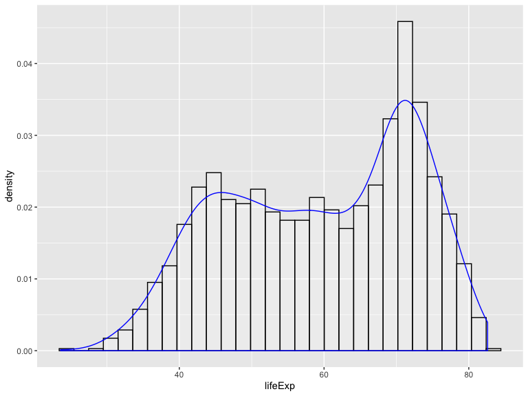
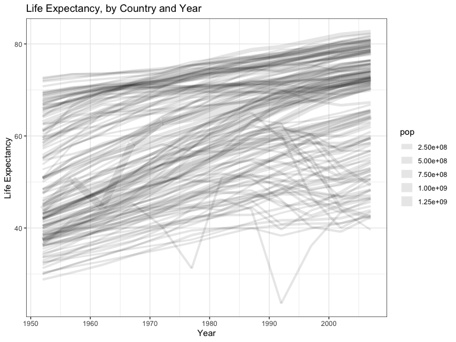
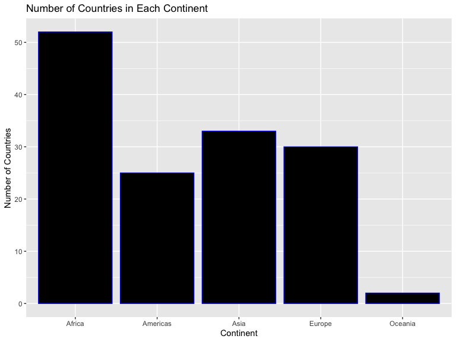
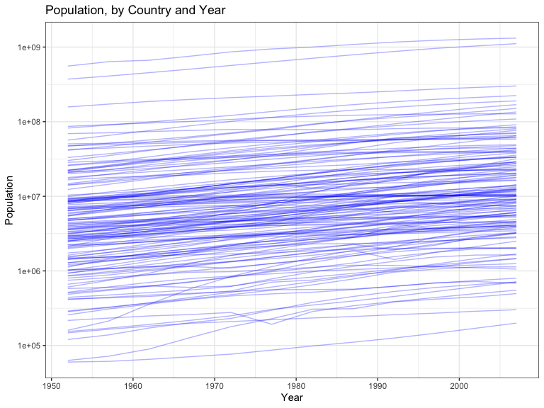
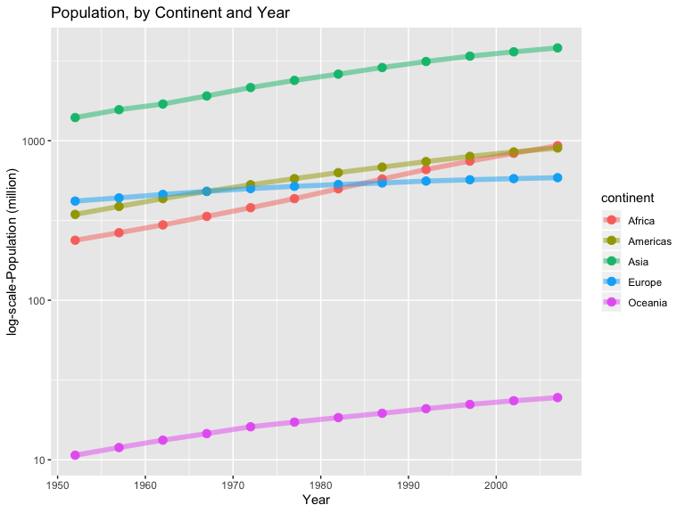
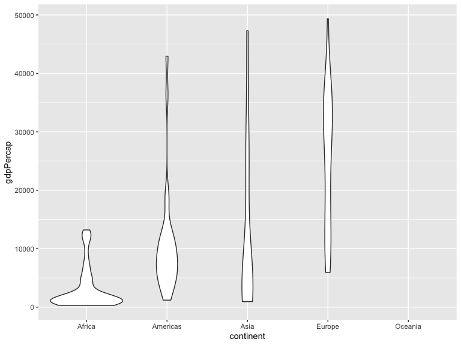
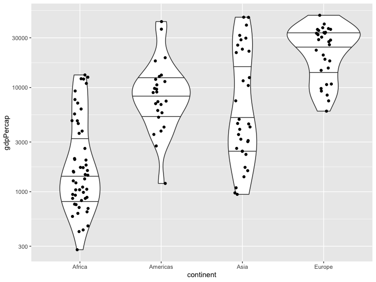

# Exercise 1


## Part 1.1

Use __filter__ to select data for _Canada_, _United States_, and _Iran_, in the 1970's.  Make it into a __datatable__


```r
temp <- gapminder %>%
  filter(country=="Canada" | country=="United States" | country=="Iran" ) %>%
  filter(year>1969 & year<1980)

knitr::kable(temp)
```


country         continent    year   lifeExp         pop   gdpPercap
--------------  ----------  -----  --------  ----------  ----------
Canada          Americas     1972    72.880    22284500   18970.571
Canada          Americas     1977    74.210    23796400   22090.883
Iran            Asia         1972    55.234    30614000    9613.819
Iran            Asia         1977    57.702    35480679   11888.595
United States   Americas     1972    71.340   209896000   21806.036
United States   Americas     1977    73.380   220239000   24072.632


## Part 1.2

Use a _pipe_ operator (%>%), and the _select_ command to select “country” and “gdpPercap” for the Part 1.1 data


```r
gapminder %>%
  filter(country=="Canada" | country=="United States" | country=="Iran" ) %>%
  filter(year>1969 & year<1980) %>%
  select(country, gdpPercap)
```

```
## # A tibble: 6 x 2
##   country       gdpPercap
##   <fct>             <dbl>
## 1 Canada           18971.
## 2 Canada           22091.
## 3 Iran              9614.
## 4 Iran             11889.
## 5 United States    21806.
## 6 United States    24073.
```


## Part 1.3

Filter gapminder to all entries that have experienced a drop in life expectancy. Include a new variable that’s the increase/change in life expectancy in your tibble. Try using both lag() and diff().

To do this, I am first arranging the data by country, and then by year...this way, i can take the difference (or the lag?) in successive entries.  I will have to exclude the first one for each country though, as this will be the last lifeExp of the preceeding country. (im sure there are more efficient ways to do this...)


```r
gapminder %>% 
  arrange(country, year) %>% 
  mutate(LifeExpIncrease= lifeExp-lag(lifeExp, 1)) %>% 
  filter(LifeExpIncrease<0) 
```

```
## # A tibble: 221 x 7
##    country    continent  year lifeExp      pop gdpPercap LifeExpIncrease
##    <fct>      <fct>     <int>   <dbl>    <int>     <dbl>           <dbl>
##  1 Albania    Europe     1992    71.6  3326498     2497.          -0.419
##  2 Algeria    Africa     1952    43.1  9279525     2449.         -33.3  
##  3 Angola     Africa     1952    30.0  4232095     3521.         -42.3  
##  4 Angola     Africa     1987    39.9  7874230     2430.          -0.036
##  5 Australia  Oceania    1952    69.1  8691212    10040.          -6.20 
##  6 Austria    Europe     1952    66.8  6927772     6137.         -14.4  
##  7 Bahrain    Asia       1952    50.9   120447     9867.         -28.9  
##  8 Bangladesh Asia       1952    37.5 46886859      684.         -38.2  
##  9 Benin      Africa     1952    38.2  1738315     1063.         -41.2  
## 10 Benin      Africa     2002    54.4  7026113     1373.          -0.371
## # … with 211 more rows
```


Also, to be able to sort through and check this, I am also including a data table that includes _all_ changes in lifeExp (increase and decrese)...


```r
timp <- gapminder %>% 
  arrange(country, year) %>% 
  mutate(LifeExpIncrease= lifeExp-lag(lifeExp, 1))

kable(timp[1:5,])
```


country       continent    year   lifeExp        pop   gdpPercap   LifeExpIncrease
------------  ----------  -----  --------  ---------  ----------  ----------------
Afghanistan   Asia         1952    28.801    8425333    779.4453                NA
Afghanistan   Asia         1957    30.332    9240934    820.8530             1.531
Afghanistan   Asia         1962    31.997   10267083    853.1007             1.665
Afghanistan   Asia         1967    34.020   11537966    836.1971             2.023
Afghanistan   Asia         1972    36.088   13079460    739.9811             2.068


And make it neater by rounding to 2 decimal places.


```r
tempp <- gapminder %>% 
  arrange(country, year) %>% 
  mutate(LifeExpIncrease= round(lifeExp-lag(lifeExp, 1), digits=2))

knitr::kable(tempp[1:5,])
```


country       continent    year   lifeExp        pop   gdpPercap   LifeExpIncrease
------------  ----------  -----  --------  ---------  ----------  ----------------
Afghanistan   Asia         1952    28.801    8425333    779.4453                NA
Afghanistan   Asia         1957    30.332    9240934    820.8530              1.53
Afghanistan   Asia         1962    31.997   10267083    853.1007              1.66
Afghanistan   Asia         1967    34.020   11537966    836.1971              2.02
Afghanistan   Asia         1972    36.088   13079460    739.9811              2.07


## Part 1.4

I will group the data by country, then calculate the max GDP per capita for each country, and filter to select only the max rows.  I will also remove GDPperCap, but include the column "MaxGDPperCap" in there...


```r
gapminder %>% 
  group_by(country) %>% 
  mutate(maxgpdPercap = max(gdpPercap)) %>%
  filter(gdpPercap==max(gdpPercap)) %>%
  select(-gdpPercap)
```

```
## # A tibble: 142 x 6
## # Groups:   country [142]
##    country     continent  year lifeExp       pop maxgpdPercap
##    <fct>       <fct>     <int>   <dbl>     <int>        <dbl>
##  1 Afghanistan Asia       1982    39.9  12881816         978.
##  2 Albania     Europe     2007    76.4   3600523        5937.
##  3 Algeria     Africa     2007    72.3  33333216        6223.
##  4 Angola      Africa     1967    36.0   5247469        5523.
##  5 Argentina   Americas   2007    75.3  40301927       12779.
##  6 Australia   Oceania    2007    81.2  20434176       34435.
##  7 Austria     Europe     2007    79.8   8199783       36126.
##  8 Bahrain     Asia       2007    75.6    708573       29796.
##  9 Bangladesh  Asia       2007    64.1 150448339        1391.
## 10 Belgium     Europe     2007    79.4  10392226       33693.
## # … with 132 more rows
```


## Part 1.5

Produce a plot of Canada’s life expectancy vs. GDP per capita, all within one pipe, first selectingthe relevant data, and then plotting it in ggplot2.  Plot GDP per capita on the log scale.


```r
gapminder %>%
  filter(country=="Canada") %>%
  ggplot(aes(gdpPercap, lifeExp)) +
  geom_point(alpha = 0.5) +
  scale_x_log10("GDP per capita", labels = scales::dollar_format()) +
  theme_bw() +
  ylab("Life Expectancy") +
  ggtitle("Canada's Life Expectancy vs. GDP per capita") +
  xlab("GDP per capita (log-scale") +
  ylab("life expectancy")
```

<!-- -->


# Exercise #2


Here, we will explore one _Categorical_ and one _Numeric_ variable using __dplyr__.  Do do so, we will calculate relevant numeric summaries, examine some plots, a produce frequency tables when appropriate.

I will select __life Expectancy__ as the _numeric_ variable, and __Country__ as the _categorical_ variable.

### Numeric Variable - Life Expectancy

First, let's look at some simple descriptive statistics:


```r
gapminder %>%
  select(lifeExp) %>%
  summary()
```

```
##     lifeExp     
##  Min.   :23.60  
##  1st Qu.:48.20  
##  Median :60.71  
##  Mean   :59.47  
##  3rd Qu.:70.85  
##  Max.   :82.60
```

Missing from those summaries is the standard deviation.  The __SD of life expectancy is 12.92__.

The __range of life expectancy is 23.6, 82.6 = 59__ , and the __interquartile range is 22.65__

Let's also take a look at the distribution of life expectancy (again, this is all ignoring the fact that these measurements come from multiple years, for different countries).

#### Emperical Distribution of Life Expectancy

Let's look at a histogram and density plot of Life Expectancy


```r
gapminder %>%
  ggplot(aes(lifeExp)) +
  geom_histogram(aes(y=..density..), col="black",
                 fill="white", alpha = .2) +
  geom_density(col="blue")
```

<!-- -->


#### Life Expectancy, by Year and Country 

Here, let's expore life expectancy.  The following plot plots life expectancies over years.  Each line is for a different country, and the size of the line
is proportional to the size of their population.

I know that I shouldn't use all of these in a plot, but I wanted to get some practice with using different aspects of ggplot (i.e. the "population" size incroporated into the plot doesn't really add must, it probably takes away from the plot,... but i wanted to make sure I was able to include this sort of a feature in terms of how to code it up.)


```r
ggplot(gapminder, aes(x=year, y=lifeExp, z=country, size=pop)) +
  geom_line(alpha = 0.1) +
  theme_bw() +
  ggtitle("Life Expectancy, by Country and Year") +
  ylab("Life Expectancy")+
  xlab("Year")
```

<!-- -->


### Categorical Variable - Continent

I'll mention here that it's a bit weird to summarize any of the categorical variables on their own, as they are simply a list of countries and continents.  So, what I will do is summarize things about a continent, regartding the other variables.


In total, there are 5 continents in total in this dataset.  

The continents we have data for are: 

  

```r
  levels(gapminder$continent)
```

```
## [1] "Africa"   "Americas" "Asia"     "Europe"   "Oceania"
```
 
It is of interest to know how many contries are in each of the continents.  Following is a table summarizing how many countries are in each of the continents.


```r
gapminder %>%
  filter(year == 2007) %>%
  select(continent) %>%
  table()
```

```
## .
##   Africa Americas     Asia   Europe  Oceania 
##       52       25       33       30        2
```


Let's look at a visual of the frequency table using a barplot:


```r
gapminder %>%
  filter(year == 2007) %>%
  select(continent) %>%
  ggplot() +
  aes(continent) + 
  geom_bar( col="blue", fill="black") + 
  ggtitle("Number of Countries in Each Continent") +
  xlab("Continent") +
  ylab("Number of Countries")
```

<!-- -->


# Exercise #3


## Plot 1 - Examine Population Growth by Year

To examine population growth by year I will look at the following.  First, I will plot populaton vs year, for each country.  I will also attempt to do this for each continent, to see how populatons are growing on each continent (this of course is not adjusted by land size, which would be meaningful to include)

__Population groth by Country__

The following looks at how populations are growing over the years, for each country.  Note that populaton is on the log-scale to account for exponential growth:


```r
gapminder %>%
  arrange(country, year) %>%
  ggplot( aes(x=year, y=pop, z=country)) +
  scale_y_log10() +
  geom_line(alpha = 0.3, colour="blue", width=1.2) +
  theme_bw() +
  ggtitle("Population, by Country and Year") +
  ylab("Population")+
  xlab("Year")
```

<!-- -->


We can see from the above plot how populations are growing over time.  

It may be more interesting to examine populaton growth by continent, so let's do that.


__Population Growth by Continent__

First in a table we can look at...


```r
tump <- gapminder %>% 
  arrange(continent, year) %>%
  group_by(continent, year) %>% 
  summarize(TotalPop = sum(pop, na.rm=T))

  knitr::kable(tump[1:5,])
```


continent    year    TotalPop
----------  -----  ----------
Africa       1952   237640501
Africa       1957   264837738
Africa       1962   296516865
Africa       1967   335289489
Africa       1972   379879541


Then, by looking at a plot:


```r
gapminder %>% 
  group_by(continent, year) %>% 
  arrange(continent, year) %>%
  summarize(TotalPop = sum(pop, na.rm=T)/1000000) %>%
  ggplot( aes(x=year, y=TotalPop, colour=continent)) +
  scale_y_log10() +
  geom_point(alpha = 1, size=3) +
  geom_line(alpha = 0.5, size=2) +
  ggtitle("Population, by Continent and Year") +
  ylab("log-scale-Population (million)") +
  xlab("Year")
```

<!-- -->


## Plot 2 - Examine GDP/cap Distribution in 2007

We will examione GDP Per Capita in 2007.  For the sake of documenting different forms of plots, I will progress through a series of plots, to display different featuers.  I will also do this mostly for myself so that I am able to praactice, and record different ways to do things.


First, look at GDP Per Capita __separated by continent.__


```r
gapminder %>%
  filter(year==2007) %>%
  ggplot( aes(x=continent, y=gdpPercap)) +
  geom_violin()
```

<!-- -->

If we wanted to filter out Oceania as well, as they are made up of only 2 countries (I believe)...

I will keep Oceania out of plots for the remainder of this exercise.


```r
gapminder %>%
  filter(year==2007, continent != "Oceania") %>%
  ggplot( aes(x=continent, y=gdpPercap)) +
  geom_violin()
```

<!-- -->


Note that we also wish to look at this on the log-scale... I will do that here.  I will also add in jitter points, and quartile lines (for my own exploration...)


```r
gapminder %>%
  filter(year==2007, continent != "Oceania") %>%
  ggplot( aes(x=continent, y=gdpPercap)) +
  geom_violin(draw_quantiles = c(0.25, 0.5, 0.75)) +
  geom_jitter(height = 0, width = 0.1) +
  scale_y_log10() 
```

<!-- -->


I would like to be able to scale the size of the plots to be proportional to their populaton sizes, althgouh I don't have time to figure that out right now.  I would have to create a new vector, I believe, that is the sum of all of the populaton sizes for each continent, and then use this in the "scale" argument...but I dont have time to figure out the nuances of that at the moment...well, I know it would be sort of like I did in the previous plot with population size for continents, just isolating the 2007 year...but I will leave this exploration for another day.

# The End :)
