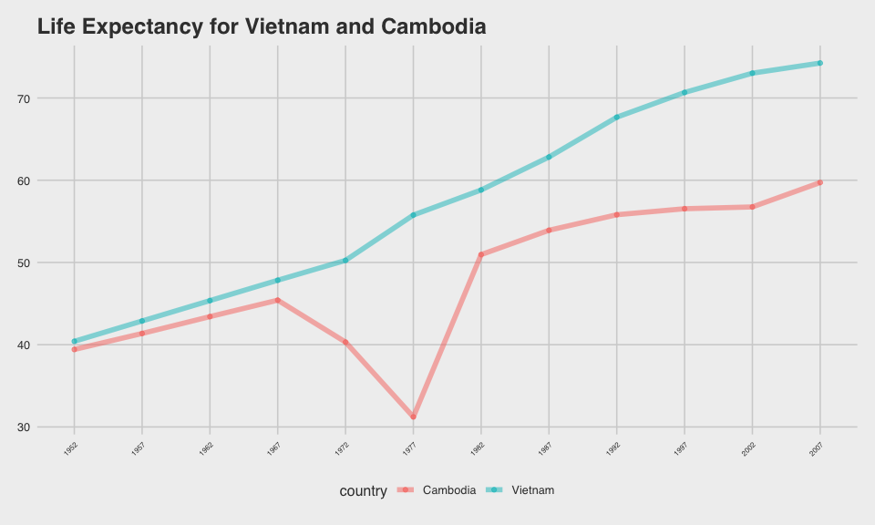
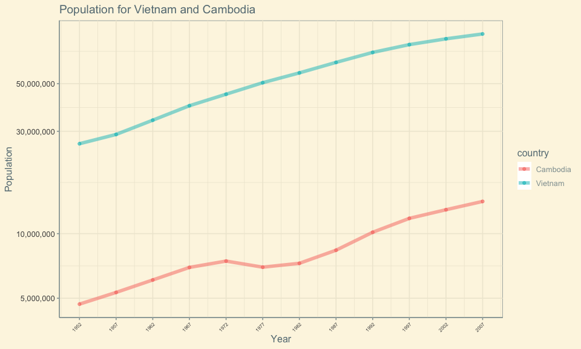

# Introduction

This document is for Assignment #3.

## The Assignment: More _dplyr_ and _ggplot2_

In this assignment, we will explore more about _dplyr_ and _ggplot2_.  The focus will be to use dplyr to wrangle the data, and then to make some plots of it.

I will write things up more step-by-step, as I explore the tools.  I am writing this in a way to document for myself, how to do things, and the different options available.

## Some Resources

A resource I will be making heavy use of is the [ggplot2 Cheat Sheet by RStudio](https://rstudio.com/wp-content/uploads/2015/03/ggplot2-cheatsheet.pdf)

Another sort of [helpful resource](https://www.datanovia.com/en/blog/ggplot-axis-ticks-set-and-rotate-text-labels/) was this one

# The 3 Tasks

## (1) Option 5 - Life Expectancy by Continent

### Intro

Here, we will examine how _life expectancy_ is changing over _continents_.

I will examine this in a few different ways...some of it will be over-kill, but I want to practice makign differnt plots with different features incliuded, so this is for the sake of exploration of _ggplot2_.

### Plots to examine this

Here, we will produce a table to life expectancy by continent:


```r
gapminder %>% 
  arrange(continent, year) %>%
  group_by(continent, year) %>% 
  summarize(MeanLifeExpectancy = round(mean(lifeExp, na.rm=T), digits=3)) %>%
  DT::datatable()
```

<!--html_preserve--><div id="htmlwidget-7719d865892512e19964" style="width:100%;height:auto;" class="datatables html-widget"></div>
<script type="application/json" data-for="htmlwidget-7719d865892512e19964">{"x":{"filter":"none","data":[["1","2","3","4","5","6","7","8","9","10","11","12","13","14","15","16","17","18","19","20","21","22","23","24","25","26","27","28","29","30","31","32","33","34","35","36","37","38","39","40","41","42","43","44","45","46","47","48","49","50","51","52","53","54","55","56","57","58","59","60"],["Africa","Africa","Africa","Africa","Africa","Africa","Africa","Africa","Africa","Africa","Africa","Africa","Americas","Americas","Americas","Americas","Americas","Americas","Americas","Americas","Americas","Americas","Americas","Americas","Asia","Asia","Asia","Asia","Asia","Asia","Asia","Asia","Asia","Asia","Asia","Asia","Europe","Europe","Europe","Europe","Europe","Europe","Europe","Europe","Europe","Europe","Europe","Europe","Oceania","Oceania","Oceania","Oceania","Oceania","Oceania","Oceania","Oceania","Oceania","Oceania","Oceania","Oceania"],[1952,1957,1962,1967,1972,1977,1982,1987,1992,1997,2002,2007,1952,1957,1962,1967,1972,1977,1982,1987,1992,1997,2002,2007,1952,1957,1962,1967,1972,1977,1982,1987,1992,1997,2002,2007,1952,1957,1962,1967,1972,1977,1982,1987,1992,1997,2002,2007,1952,1957,1962,1967,1972,1977,1982,1987,1992,1997,2002,2007],[39.136,41.266,43.319,45.335,47.451,49.58,51.593,53.345,53.63,53.598,53.325,54.806,53.28,55.96,58.399,60.411,62.395,64.392,66.229,68.091,69.568,71.15,72.422,73.608,46.314,49.319,51.563,54.664,57.319,59.611,62.618,64.851,66.537,68.021,69.234,70.728,64.409,66.703,68.539,69.738,70.775,71.938,72.806,73.642,74.44,75.505,76.701,77.649,69.255,70.295,71.085,71.31,71.91,72.855,74.29,75.32,76.945,78.19,79.74,80.719]],"container":"<table class=\"display\">\n  <thead>\n    <tr>\n      <th> <\/th>\n      <th>continent<\/th>\n      <th>year<\/th>\n      <th>MeanLifeExpectancy<\/th>\n    <\/tr>\n  <\/thead>\n<\/table>","options":{"columnDefs":[{"className":"dt-right","targets":[2,3]},{"orderable":false,"targets":0}],"order":[],"autoWidth":false,"orderClasses":false}},"evals":[],"jsHooks":[]}</script><!--/html_preserve-->


Let's take a look at one plot of that data...


```r
gapminder %>% 
  arrange(continent, year) %>%
  group_by(continent, year) %>% 
  summarize(MeanLifeExpectancy = mean(lifeExp, na.rm=T)) %>%
  ggplot(aes(x=year, y=MeanLifeExpectancy, col=continent)) +
  geom_point(size=3) +
  geom_line(alpha=0.3, size=3) +
  ggtitle("Life Expectancy by Year and Continent") +
  xlab("Year") +
  ylab("Mean Life Expectancy on Continent")
```

<!-- -->

Here we see that life expectancy is increasing across all continents over the years. The increases are all fairly proportional/constant, except for Africa, which we notice has a lower rate of increase from 1992 onward.


We also may want to look at the data in facets, faceting by continent, so that we keep the individual country-level data.

Let's take a look at a plot of that...


```r
gapminder %>% 
  arrange(continent, year) %>%
  ggplot(aes(year, lifeExp, size=pop, colour=continent, group=country)) +
  facet_wrap(~ continent, nrow=1) +
  geom_point(alpha = 0.2) +
  geom_line(alpha=0.5, size=0.5) +
  labs(title="Life Expectancy Growth By Country, Faceted by Continent", x="Year", y="Life Expectancy (years)") +
  scale_x_continuous(breaks=seq(1952,2007,5), labels=seq(1952,2007,5)) +
  theme(axis.text.x = element_text(angle = 45, vjust = 1, hjust=1, size=6))
```

<!-- -->

We see similar trends here.  We can also note the large variability in life expectancy within a continent, except for Oceania, which is compriosed of only 2 counrtires, so to be expected.  We can also note that in Africa, it seems to be only a handful of countries that seem to be pulling down the mean life expectancy from 1992 onward, a noted in the previous plot. This suggests that the slower rate of increase for Africa from 1992 onward, as noted in the previous plot, may be more due to a few countries, rather than the entire continent as a whole.


### A bunch of extra plots (for me to learn)

In this section I will practice making a bunch of differnt plots.  I wont describe what is seen in them.  I also wont focus on axes labels, etc... __my goal here is to get a few differenty types of plots to show what I want__ (without worrying about making them beautiful!)


We may want to examine boxplots for each year, faceted by continent.  I will reomve Oceania, as they are comprosed of only 2 countries.  Let's look at that:


```r
gapminder %>%
  filter(continent != "Oceania") %>%
  ggplot(aes(x=continent, y=lifeExp)) +
  geom_boxplot() +
  facet_wrap(~ year, nrow=2) +
  theme_bw() +
  theme(axis.text.x = element_text(angle = 45, vjust = 1, hjust=1, size=8))
```

<!-- -->

This plot isn't very informative...


I personally prefer the look of violins too...


```r
gapminder %>%
  filter(continent != "Oceania") %>%
  ggplot(aes(x=continent, y=lifeExp)) +
  geom_violin(draw_quantiles = c(0.25, 0.5, 0.75)) +
  geom_jitter(height = 0, width = 0.1, size=0.5, alpha=0.4) +
  facet_wrap(~ year, nrow=2) +
  theme_bw() +
  theme(axis.text.x = element_text(angle = 45, vjust = 1, hjust=1, size=8))
```

<!-- -->


Still, not a particularly informative plot...

It would be easier to see trends if we were to look at boxplots of life expectancy over time, faceted by continent...so let's do that.  I'm letting the scales be different for each continent...


```r
gapminder %>%
  filter(continent != "Oceania") %>%
  ggplot(aes(x=as.factor(year), y=lifeExp)) +
  geom_boxplot() +
  facet_wrap(~ continent, nrow=5, scales="free") +
  theme_bw() +
  theme(axis.text.x = element_text(angle = 45, vjust = 1, hjust=1, size=8)) +
  labs(title="Life Expectancy Growth By Year, Faceted by Continent", x="Year", y="Life Expectancy (years)")
```

<!-- -->

Somewhat helpful for seeing trends on comntinents...

We can look at the same data, but separated in a different way, and showing densities instead.


```r
gapminder %>%
  filter(continent != "Oceania") %>%
  ggplot(aes(lifeExp, continent)) +
  ggridges::geom_density_ridges() +
  facet_wrap(~ year, nrow=4, dir="v") +
  theme_bw() +
  theme(axis.text.x = element_text(angle = 45, vjust = 1, hjust=1, size=8)) +
  theme(axis.text.y = element_text(angle = -45, vjust = 1, hjust=1, size=8)) 
```

<!-- -->

Thsi plot isn't tht informtive...difficult to compare the columns...

Let's produce a similar plot, but this time faceting on continent...so that we can see how life expectancy distribution has changed as years pass, for each continent.


```r
gapminder %>%
  filter(continent != "Oceania") %>%
  ggplot(aes(lifeExp, as.factor(year))) +
  ggridges::geom_density_ridges() +
  facet_wrap(~ continent, nrow=6, dir="v") +
  theme_bw() +
  theme(axis.text.x = element_text(angle = 45, vjust = 1, hjust=1, size=8)) +
  theme(axis.text.y = element_text(angle = -45, vjust = 1, hjust=1, size=8)) 
```

<!-- -->

We can see trends well in this plot...


## (2) Option 1 (slightly revised)

### Intro

Here, I will begin by using a life expectancy of less than 65 as a 'low life expectancy'.  *__BUT__*, I will examine "high life expectancy" instead in my tables and plots.  To do so, I wll define a life expectancy above 65 as "long".  This is an arbitrary choice, but I chose this value for a few reasons.  The first is that this is a common age for retirement in north america, and so I will see how many countries have a life expectancy that is past a common retirement age.  I've also chosen this value as most countries had a life expectancy below this in 1952, and I want to see how many have past this threshold, and at what point they did.

### How many above 65 life expectancy in 1952?

First, we will ask how many countries on each continent have life expectancies above 65 in 1952.


```r
gapminder %>%
  filter(year==1952) %>%
  group_by(continent)
```

```
## # A tibble: 142 x 6
## # Groups:   continent [5]
##    country     continent  year lifeExp      pop gdpPercap
##    <fct>       <fct>     <int>   <dbl>    <int>     <dbl>
##  1 Afghanistan Asia       1952    28.8  8425333      779.
##  2 Albania     Europe     1952    55.2  1282697     1601.
##  3 Algeria     Africa     1952    43.1  9279525     2449.
##  4 Angola      Africa     1952    30.0  4232095     3521.
##  5 Argentina   Americas   1952    62.5 17876956     5911.
##  6 Australia   Oceania    1952    69.1  8691212    10040.
##  7 Austria     Europe     1952    66.8  6927772     6137.
##  8 Bahrain     Asia       1952    50.9   120447     9867.
##  9 Bangladesh  Asia       1952    37.5 46886859      684.
## 10 Belgium     Europe     1952    68    8730405     8343.
## # … with 132 more rows
```


The following table presents the proportion of countries in each of the continents that has a life expectancy above 65, in 1952.


```r
gapminder %>%
  filter(year==1952) %>%
  mutate(LifeOver65 = lifeExp>65) %>%
  group_by(continent) %>%
  summarize(PropOver = sum(LifeOver65)/length(LifeOver65))
```

```
## # A tibble: 5 x 2
##   continent PropOver
##   <fct>        <dbl>
## 1 Africa      0     
## 2 Americas    0.12  
## 3 Asia        0.0303
## 4 Europe      0.567 
## 5 Oceania     1
```


We can see as one example that in Africa 0% of countires do, while in Europe 57% of countries do.

Now, let's see how this statistic has changed by 2007.


### How many above 65 life expectancy in 2007?


The following table presents the proportion of countries in each of the continents that has a life expectancy above 65, in 1952.


```r
gapminder %>%
  filter(year==2007) %>%
  mutate(LifeOver65 = lifeExp>65) %>%
  group_by(continent) %>%
  summarize(PropOver = sum(LifeOver65)/length(LifeOver65))
```

```
## # A tibble: 5 x 2
##   continent PropOver
##   <fct>        <dbl>
## 1 Africa       0.173
## 2 Americas     0.96 
## 3 Asia         0.758
## 4 Europe       1    
## 5 Oceania      1
```

We can see tht by 2007 many continents are at 96% or higher of all their countries having a life expectancy greater than 65.  Asia sits at 76%, and Africa at 17%.  These have improved since 1952 though.


### How has this statistic changed over the years?

Now, we will go ahead and calculate and then plot, the proportion of countires in each continent that have life expectancies over 65, from 1952 up to 2007.


```r
gapminder %>%
  mutate(LifeOver65 = lifeExp>65) %>%
  group_by(continent, year) %>%
  summarize(PropOver = sum(LifeOver65)/length(LifeOver65)) %>%
  ggplot(aes(year,PropOver,group=continent, colour=continent)) +
  geom_line(alpha=0.3, size=2) +
  geom_point(size=3) +
  labs(title="Proportion of Countries in a Continent with LifeExp>65", x="Year", y="Proportion with Life Expectancy over 65") +
  scale_x_continuous(breaks=seq(1952,2007,5), labels=seq(1952,2007,5)) +
  theme(axis.text.x = element_text(angle = 45, vjust = 1, hjust=1, size=6))
```

<!-- -->


## (3) Option 6 - Interesting Stories

### Intro

Here, I plan to explore an interesting trend discovered in the previous exercise.  Let's get to showing thta below...

### What do we see?

To begin this discussion, let's take a look at a plot presented earlier...


```r
gapminder %>% 
  arrange(continent, year) %>%
  ggplot(aes(year, lifeExp, size=pop, colour=continent, group=country)) +
  facet_wrap(~ continent, nrow=1) +
  geom_point(alpha = 0.2) +
  geom_line(alpha=0.5, size=0.5) +
  labs(title="Life Expectancy Growth By Country, Faceted by Continent", x="Year", y="Life Expectancy (years)") +
  scale_x_continuous(breaks=seq(1952,2007,5), labels=seq(1952,2007,5)) +
  theme(axis.text.x = element_text(angle = 45, vjust = 1, hjust=1, size=6))
```

<!-- -->


When viewing this plot, you can see (at least) 2 interesting and large drops in life expectancy.

So, who are those countries?  When exactly did the big decrease in life expectancy occur?  And Why?  What are the historical events attached to these?  Most likely a war, or some other human catostrophe.

Let's get into finding out their stories...


### Who Are They?

Let's find out which countries those are...


```r
gapminder %>%
  arrange(continent, year) %>%
  filter( (continent=="Africa" & lifeExp<25) | (continent=="Asia" & lifeExp<35 & year==1977) ) %>%
  DT::datatable()
```

<!--html_preserve--><div id="htmlwidget-f69f8b7519c5e33f7efe" style="width:100%;height:auto;" class="datatables html-widget"></div>
<script type="application/json" data-for="htmlwidget-f69f8b7519c5e33f7efe">{"x":{"filter":"none","data":[["1","2"],["Rwanda","Cambodia"],["Africa","Asia"],[1992,1977],[23.599,31.22],[7290203,6978607],[737.0685949,524.9721832]],"container":"<table class=\"display\">\n  <thead>\n    <tr>\n      <th> <\/th>\n      <th>country<\/th>\n      <th>continent<\/th>\n      <th>year<\/th>\n      <th>lifeExp<\/th>\n      <th>pop<\/th>\n      <th>gdpPercap<\/th>\n    <\/tr>\n  <\/thead>\n<\/table>","options":{"columnDefs":[{"className":"dt-right","targets":[3,4,5,6]},{"orderable":false,"targets":0}],"order":[],"autoWidth":false,"orderClasses":false}},"evals":[],"jsHooks":[]}</script><!--/html_preserve-->


The two are Rwanda with a big event in 1992, and Cambodia with a big event in 1977 (and preceeding years as well).

First, let's see them highlighted on a plot. The code below produces an indictor to use as the line size/width for the plot.


```r
gapminder %>% 
  mutate(Indicator = ((as.numeric(country=="Rwanda" | country=="Cambodia")+1)*2)) %>%
  arrange(continent, year) %>%
  filter(continent=="Africa" | continent=="Asia") %>%
  ggplot(aes(year, lifeExp, colour=Indicator, group=country, size=Indicator)) +
  facet_wrap(~ continent, nrow=1) +
  geom_point(alpha = 0.3) +
  geom_line(alpha=0.5, size=2) +
  labs(title="Life Expectancy Growth By Country, Highlighting Rwanda and Cambodia", x="Year", y="Life Expectancy (years)") +
  scale_x_continuous(breaks=seq(1952,2007,5), labels=seq(1952,2007,5)) +
  theme(axis.text.x = element_text(angle = 45, vjust = 1, hjust=1, size=6))
```

<!-- -->


I'd like to work on fixing the legend for this plot, and refine a few things, but I am going to leave it at thsi for now.

We can see here that Rwanda had a big drop in life expectancy in 1992 and Cambodia had drops in 1972 and 1977.  Soon we will get into exploring what may have been the cause of these, but first, let's see if other thigns were affected in these years.

Let's look at gdp per capita, for those countries, with a particular view to those years.


```r
gapminder %>% 
  arrange(continent, year) %>%
  filter(country=="Rwanda" | country=="Cambodia") %>%
  ggplot(aes(year, gdpPercap, group=country)) +
  facet_wrap(~ country, nrow=1) +
  geom_point(alpha = 1) +
  geom_line(alpha=0.5, size=2) +
  labs(title="GDP Per Capita for Rwanda and Cambodia", x="Year", y="GDP Per Capita") +
  scale_x_continuous(breaks=seq(1952,2007,5), labels=seq(1952,2007,5)) +
  theme(axis.text.x = element_text(angle = 45, vjust = 1, hjust=1, size=6)) +
  theme_gray()
```

<!-- -->

It is difficult to interpret visually if the events taking place in these two countries had an impact on GDP per capita.  We can see that in Cambodia there was a drop in GDP per capita in 1972, when the _event_ seems to have its start.  In Rwanda there is a bigger drop in 1992 as well as the 5-year period after the _event_.

These events were a _genocide_ in Rwanda and likely a _war_ in Cambodia.  We will get to exploring what these events were exactly in a bit.  Given the potential causes of drop in life expectancy, let's also explore what happened to population around this time.

Let's also change the plot theme just because...


```r
gapminder %>% 
  arrange(continent, year) %>%
  filter(country=="Rwanda" | country=="Cambodia") %>%
  ggplot(aes(year, pop, group=country)) +
  facet_wrap(~ country, nrow=1) +
  geom_point(alpha = 1, size=2) +
  geom_line(alpha=0.5, size=3) +
  labs(title="Population for Rwanda and Cambodia", x="Year", y="Population") +
  scale_x_continuous(breaks=seq(1952,2007,5), labels=seq(1952,2007,5)) +
  theme(axis.text.x = element_text(angle = 45, vjust = 1, hjust=1, size=6)) +
  theme_dark()
```

<!-- -->


Looking at these plots, we can see that both countries also experienced disruptions to their population growth around the time of the _events_.  This makes complete sense, as a sharp drop in life expectancy should be correlated with a decrease in population.


### What were these events?

Well, the Rwandan genocide is probably pretty well known.  I wont provide any background on that, as I'm focussing my work her on exploration of ggplot2 and dplyr, but you can [read more here](https://en.wikipedia.org/wiki/Rwanda) if you like.

What about Cambodia?  In 1968-1975 there was a [civil war in Cambodia](https://en.wikipedia.org/wiki/Cambodian_Civil_War).  The civil war was very much related to the [Vietnam War](https://en.wikipedia.org/wiki/Vietnam_War) that took place from about 1955-1975.  You can read a brief background about either with the links provided.

Now one question that arises here is how did Veitnam's life expectancy do at this time?  The Cambodian war was centered around what was going on in Vietnam at the time, so let's just take a quick look at Vietnam at the time...

### What about Vietnam?

As mentioned, the war in Cambodia was very connected to the Vietnam war taking place at the same time (and beginning much earlier).  So, we should compare Vietnam and Cambodia and see how they relate


```r
gapminder %>% 
  arrange(continent, year) %>%
  filter(country=="Vietnam" | country=="Cambodia") %>%
  ggplot(aes(year, lifeExp, group=country, colour=country)) +
  geom_point(alpha = 0.6) +
  geom_line(alpha=0.5, size=2) +
  labs(title="Life Expectancy for Vietnam and Cambodia", x="Year", y="Life Expectancy (years)") +
  scale_x_continuous(breaks=seq(1952,2007,5), labels=seq(1952,2007,5)) +
  theme(axis.text.x = element_text(angle = 45, vjust = 1, hjust=1, size=6)) +
  theme_gray()
```

<!-- -->


Quite interesting to see that Vietnam does not appear to be affected at the same time.  Unclear on the reason for this?  Maybe they had fewere causauties...not a likely reason.  Maybe their population is much larger, and so it had a smaller effect...also not that likely. Maybe the data the governemnt in Vietnam is releasing at the time is not very reliable or accurate...seems reasonable.

Either way, we don't know why we dont see the same pattern in Vietnam as we do in Cambodia.  This would require more (non-statistical) research which I'm not going to do.


So, how did population compare for the two?


```r
gapminder %>% 
  arrange(continent, year) %>%
  filter(country=="Vietnam" | country=="Cambodia") %>%
  ggplot(aes(year, pop, group=country, colour=country)) +
  geom_point(alpha = 0.6) +
  geom_line(alpha=0.5, size=2) +
  labs(title="Population for Vietnam and Cambodia", x="Year", y="Population") +
  scale_x_continuous(breaks=seq(1952,2007,5), labels=seq(1952,2007,5)) +
  scale_y_log10(labels=scales::comma_format()) +
  theme(axis.text.x = element_text(angle = 45, vjust = 1, hjust=1, size=6)) +
  theme_gray()
```

<!-- -->


Again, we don't see the same did in population in Vietnam.  We don't have an explanation as to why that is right now, but it is something of interest to take note of.
