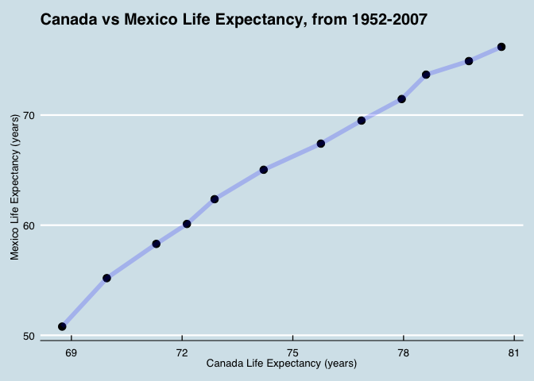

# Introduction

This document is for Assignment #4.  The goal of this assignment is to work with __tidyr__ to make _tidy data_.  

The assignment consists of choosing an _option_ of different tasks to preform, and 3 different tasks.  These are done below.

Through peer- reviews, I've learned about making the table of contents _foalting_, so I'm excited to try that out here...

# Exercise 1 - Univariate Data Reshaping

Here, we are given two options to choose from.  I am choosing to do __Univariate Option 1__.  I will carry out 3 tasks here.

## Part 1.1 - Widening

Here, we will work with the _gapminder_ dataset.  I will take the data (which is already in tidy format), and reshape it to have one row per year, and columns for life expectancy, for _Canada_, _America_, and _Mexico_.

This will be made into a tibble and displayed as a _datatable_.


```r
CMA_lifeExp <- gapminder %>% 
  filter(country=="Canada" 
         | country=="United States" 
         | country=="Mexico") %>% 
  pivot_wider(id_cols = year, names_from = country, 
              values_from = lifeExp) 
DT::datatable(CMA_lifeExp)
```

<!--html_preserve--><div id="htmlwidget-f026695e48f9396edcfb" style="width:100%;height:auto;" class="datatables html-widget"></div>
<script type="application/json" data-for="htmlwidget-f026695e48f9396edcfb">{"x":{"filter":"none","data":[["1","2","3","4","5","6","7","8","9","10","11","12"],[1952,1957,1962,1967,1972,1977,1982,1987,1992,1997,2002,2007],[68.75,69.96,71.3,72.13,72.88,74.21,75.76,76.86,77.95,78.61,79.77,80.653],[50.789,55.19,58.299,60.11,62.361,65.032,67.405,69.498,71.455,73.67,74.902,76.195],[68.44,69.49,70.21,70.76,71.34,73.38,74.65,75.02,76.09,76.81,77.31,78.242]],"container":"<table class=\"display\">\n  <thead>\n    <tr>\n      <th> <\/th>\n      <th>year<\/th>\n      <th>Canada<\/th>\n      <th>Mexico<\/th>\n      <th>United States<\/th>\n    <\/tr>\n  <\/thead>\n<\/table>","options":{"columnDefs":[{"className":"dt-right","targets":[1,2,3,4]},{"orderable":false,"targets":0}],"order":[],"autoWidth":false,"orderClasses":false}},"evals":[],"jsHooks":[]}</script><!--/html_preserve-->


## Part 1.2 - Make a Plot

Here, we will use this _widened_ data to make a plot comparing the life expectancies of Canada, USA, and Mexico.

Since I have selected 3 countries, and I am interpreting the task as to plot x=country1 and y=country2, I will select one pair of countries (Canada and Mexico) for which to make the plot. (NOTE: the question could also be interpreted as wanting to plot life expectancies, over time, for multiple countries on the same plot.  I will _not_ be making such a plot)


```r
CMA_lifeExp %>% 
  ggplot(aes(x=Canada, y=Mexico)) +
  geom_point(size=3) +
  geom_line(size=2, alpha=0.2, colour="blue") +
  ggtitle("Canada vs Mexico Life Expectancy, from 1952-2007") +
  xlab("Canada Life Expectancy (years)") +
  ylab("Mexico Life Expectancy (years)" ) +
  theme(plot.title = element_text(hjust = 0.5)) +
  ggthemes::theme_economist()
```

<!-- -->

As one would expect, there are highly correlated. 


## Part 1.3 - Re-Lengthen

Now, let's put the data back the way it was... in other words, let's re-lengthen it...


```r
CMA_lifeExp %>% 
  pivot_longer(cols = c("Canada", 
                        "United States", "Mexico"), 
               names_to = "country", 
               values_to = "lifeExp") %>% 
  arrange(country) %>%
  DT::datatable()
```

<!--html_preserve--><div id="htmlwidget-698b7d57276fe010c196" style="width:100%;height:auto;" class="datatables html-widget"></div>
<script type="application/json" data-for="htmlwidget-698b7d57276fe010c196">{"x":{"filter":"none","data":[["1","2","3","4","5","6","7","8","9","10","11","12","13","14","15","16","17","18","19","20","21","22","23","24","25","26","27","28","29","30","31","32","33","34","35","36"],[1952,1957,1962,1967,1972,1977,1982,1987,1992,1997,2002,2007,1952,1957,1962,1967,1972,1977,1982,1987,1992,1997,2002,2007,1952,1957,1962,1967,1972,1977,1982,1987,1992,1997,2002,2007],["Canada","Canada","Canada","Canada","Canada","Canada","Canada","Canada","Canada","Canada","Canada","Canada","Mexico","Mexico","Mexico","Mexico","Mexico","Mexico","Mexico","Mexico","Mexico","Mexico","Mexico","Mexico","United States","United States","United States","United States","United States","United States","United States","United States","United States","United States","United States","United States"],[68.75,69.96,71.3,72.13,72.88,74.21,75.76,76.86,77.95,78.61,79.77,80.653,50.789,55.19,58.299,60.11,62.361,65.032,67.405,69.498,71.455,73.67,74.902,76.195,68.44,69.49,70.21,70.76,71.34,73.38,74.65,75.02,76.09,76.81,77.31,78.242]],"container":"<table class=\"display\">\n  <thead>\n    <tr>\n      <th> <\/th>\n      <th>year<\/th>\n      <th>country<\/th>\n      <th>lifeExp<\/th>\n    <\/tr>\n  <\/thead>\n<\/table>","options":{"columnDefs":[{"className":"dt-right","targets":[1,3]},{"orderable":false,"targets":0}],"order":[],"autoWidth":false,"orderClasses":false}},"evals":[],"jsHooks":[]}</script><!--/html_preserve-->


# Exercise 2 - Multivariate Data Reshaping

Here, we are given two options to choose from.  I am choosing to do __Multivariate Option 1__.  I will carry out 3 tasks here.

I have chosen this task as it is a continuation of what was done in Exercise 1.


## Part 2.1 - Widening

Here, we will work with the _gapminder_ dataset.  I will make a tibble with one row per year, and columns for life expectancy and GDP per capita.

Like before, I willuse countries of Canada, USA, and Mexico.  I will select numeric variables of _population_ and _gdpPerCapita_.


```r
CMA_lifeExp_multi <- gapminder %>% 
  filter(country=="Canada" 
         | country=="United States" 
         | country=="Mexico") %>% 
  pivot_wider(id_cols = year, names_from = country, 
              values_from = c("pop", "gdpPercap"))

DT::datatable(CMA_lifeExp_multi)
```

<!--html_preserve--><div id="htmlwidget-48c5871daf835730395e" style="width:100%;height:auto;" class="datatables html-widget"></div>
<script type="application/json" data-for="htmlwidget-48c5871daf835730395e">{"x":{"filter":"none","data":[["1","2","3","4","5","6","7","8","9","10","11","12"],[1952,1957,1962,1967,1972,1977,1982,1987,1992,1997,2002,2007],[14785584,17010154,18985849,20819767,22284500,23796400,25201900,26549700,28523502,30305843,31902268,33390141],[30144317,35015548,41121485,47995559,55984294,63759976,71640904,80122492,88111030,95895146,102479927,108700891],[157553000,171984000,186538000,198712000,209896000,220239000,232187835,242803533,256894189,272911760,287675526,301139947],[11367.16112,12489.95006,13462.48555,16076.58803,18970.57086,22090.88306,22898.79214,26626.51503,26342.88426,28954.92589,33328.96507,36319.23501],[3478.125529,4131.546641,4581.609385,5754.733883,6809.40669,7674.929108,9611.147541,8688.156003,9472.384295,9767.29753,10742.44053,11977.57496],[13990.48208,14847.12712,16173.14586,19530.36557,21806.03594,24072.63213,25009.55914,29884.35041,32003.93224,35767.43303,39097.09955,42951.65309]],"container":"<table class=\"display\">\n  <thead>\n    <tr>\n      <th> <\/th>\n      <th>year<\/th>\n      <th>pop_Canada<\/th>\n      <th>pop_Mexico<\/th>\n      <th>pop_United States<\/th>\n      <th>gdpPercap_Canada<\/th>\n      <th>gdpPercap_Mexico<\/th>\n      <th>gdpPercap_United States<\/th>\n    <\/tr>\n  <\/thead>\n<\/table>","options":{"columnDefs":[{"className":"dt-right","targets":[1,2,3,4,5,6,7]},{"orderable":false,"targets":0}],"order":[],"autoWidth":false,"orderClasses":false}},"evals":[],"jsHooks":[]}</script><!--/html_preserve-->


## Part 2.2 - Lengthening

Now, we will relengthen the data


```r
CMA_lifeExp_multi %>% 
  pivot_longer(cols = -year,
               names_to = c(".value", "country"),
               names_sep = "_" ) %>% 
  arrange(country) %>% 
  DT::datatable()
```

<!--html_preserve--><div id="htmlwidget-6d520d013263ae9890d1" style="width:100%;height:auto;" class="datatables html-widget"></div>
<script type="application/json" data-for="htmlwidget-6d520d013263ae9890d1">{"x":{"filter":"none","data":[["1","2","3","4","5","6","7","8","9","10","11","12","13","14","15","16","17","18","19","20","21","22","23","24","25","26","27","28","29","30","31","32","33","34","35","36"],[1952,1957,1962,1967,1972,1977,1982,1987,1992,1997,2002,2007,1952,1957,1962,1967,1972,1977,1982,1987,1992,1997,2002,2007,1952,1957,1962,1967,1972,1977,1982,1987,1992,1997,2002,2007],["Canada","Canada","Canada","Canada","Canada","Canada","Canada","Canada","Canada","Canada","Canada","Canada","Mexico","Mexico","Mexico","Mexico","Mexico","Mexico","Mexico","Mexico","Mexico","Mexico","Mexico","Mexico","United States","United States","United States","United States","United States","United States","United States","United States","United States","United States","United States","United States"],[14785584,17010154,18985849,20819767,22284500,23796400,25201900,26549700,28523502,30305843,31902268,33390141,30144317,35015548,41121485,47995559,55984294,63759976,71640904,80122492,88111030,95895146,102479927,108700891,157553000,171984000,186538000,198712000,209896000,220239000,232187835,242803533,256894189,272911760,287675526,301139947],[11367.16112,12489.95006,13462.48555,16076.58803,18970.57086,22090.88306,22898.79214,26626.51503,26342.88426,28954.92589,33328.96507,36319.23501,3478.125529,4131.546641,4581.609385,5754.733883,6809.40669,7674.929108,9611.147541,8688.156003,9472.384295,9767.29753,10742.44053,11977.57496,13990.48208,14847.12712,16173.14586,19530.36557,21806.03594,24072.63213,25009.55914,29884.35041,32003.93224,35767.43303,39097.09955,42951.65309]],"container":"<table class=\"display\">\n  <thead>\n    <tr>\n      <th> <\/th>\n      <th>year<\/th>\n      <th>country<\/th>\n      <th>pop<\/th>\n      <th>gdpPercap<\/th>\n    <\/tr>\n  <\/thead>\n<\/table>","options":{"columnDefs":[{"className":"dt-right","targets":[1,3,4]},{"orderable":false,"targets":0}],"order":[],"autoWidth":false,"orderClasses":false}},"evals":[],"jsHooks":[]}</script><!--/html_preserve-->


# Exercise 3 - Joining Tables

Here there is no choice, we will work through all activities listed.  The goal is to work with _tidyr_ and _dplyr_ to work with _table joins_.

To do so, we will be working with the following made up data:


```r
guest <- read_csv("https://raw.githubusercontent.com/STAT545-UBC/Classroom/master/data/wedding/attend.csv")
email <- read_csv("https://raw.githubusercontent.com/STAT545-UBC/Classroom/master/data/wedding/emails.csv")
```


## Part 3.1 

The task here is:  For each guest in the guestlist (guest tibble), add a column for email address, which can be found in the email tibble.


